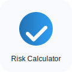

# Small Business Reality Check

Help small business owners understand how even a low-probability event can have a large Annual Loss Expectancy (ALE).

Use Case: A small retailer thinks "Hackers won't target me." Select your sector (Retail), set your asset value and exposure factor (how much you'd lose without backups), and the tool will compute SLE and ALE and produce a printable PDF.

<form id="sb-form">
  <label>Sector:
    <select id="sectorSelect">
      <option value="Retail">Retail</option>
      <option value="Healthcare">Healthcare</option>
      <option value="Finance">Finance</option>
      <option value="Manufacturing">Manufacturing</option>
    </select>
  </label>

  <label>Asset value at risk (USD): <input type="number" id="assetValue" value="100000" step="0.01" required></label>

  <label>Exposure Factor (EF %): <input type="number" id="exposureFactor" value="100" step="1" min="0" max="100"> (100% = no backups)</label>

  <label>Revenue (Optional): <input type="number" id="revenueInput" placeholder="Leave blank to use sector AvgBreachCost"></label>

  <label>Annualized Rate of Occurrence (ARO): <input type="number" id="aroValue" value="0.20" step="0.01" min="0"> (years^-1) — populated from sector data by default</label>

  <fieldset style="margin-top:0.5rem">
    <legend><strong>BCDR Strategy</strong></legend>
    <label><input type="radio" name="dr_strategy" value="Cold Site" checked> Cold Site</label>
    <label><input type="radio" name="dr_strategy" value="Warm Site"> Warm Site</label>
    <label><input type="radio" name="dr_strategy" value="Hot Site"> Hot Site</label>
  </fieldset>

  <fieldset style="margin-top:0.5rem">
    <legend><strong>Controls Checklist (PPT Framework)</strong></legend>
    <label><input type="checkbox" id="ctl-mfa"> Multi-Factor Auth (Technology) — reduces ARO by 50%</label>
    <label><input type="checkbox" id="ctl-phish"> Staff Phishing Training (People) — reduces ARO by 20%</label>
    <label><input type="checkbox" id="ctl-succession"> Succession Planning (Procedure) — reduces downtime cost by 10%</label>
  </fieldset>

  <label style="margin-top:0.6rem"><input type="checkbox" id="include-dr-cost" checked> Include DR annual cost in ROSI calculation (checked = include)</label>

  

    <button type="submit">Calculate</button>
    <button type="button" id="sb-download">Download PDF</button>
  

</form>

  

    
    

      
Risk Calculator

      
Small Business Reality Check — ALE Report

    

  

  

    <h3>Inputs</h3>
    <table class="rc-table" id="sb-inputs"></table>
  

  

    <h3>Results</h3>
    
Enter values and click Calculate to see results.

    

      <strong>Money saved by BCDR:</strong> —
    

    

      <h4>Inherent vs Residual Risk</h4>
      <canvas id="sb-bar-chart" width="520" height="200" aria-label="Inherent vs Residual ALE"></canvas>
    

    

      <h4>Sensitivity: ALE vs Exposure Factor (EF)</h4>
      <canvas id="sb-chart" width="720" height="280" aria-label="ALE vs EF chart"></canvas>
    

    

      <h4>Sensitivity: ALE vs ARO</h4>
      <canvas id="sb-chart-aro" width="720" height="280" aria-label="ALE vs ARO chart"></canvas>
    

  

  

    

      

      
Signature

    

    
Date: 

  

  <h4>Data sources</h4>
  
Sector values (ARO, AvgBreachCost, DowntimeCostPerHour) are hardcoded in the application for demonstration. Replace with your authoritative dataset or update <code>docs/assets/js/sector-data.js</code> to point at external sources.

  <ul>
    <li>SECTOR_DATA: internal benchmark dataset (editable)</li>
    <li>DR_STRATEGIES: internal BCDR assumptions</li>
  </ul>

